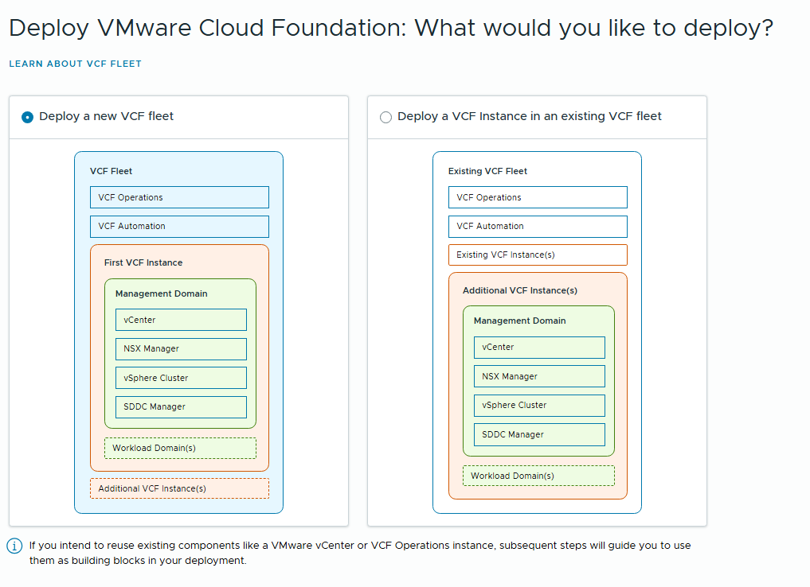
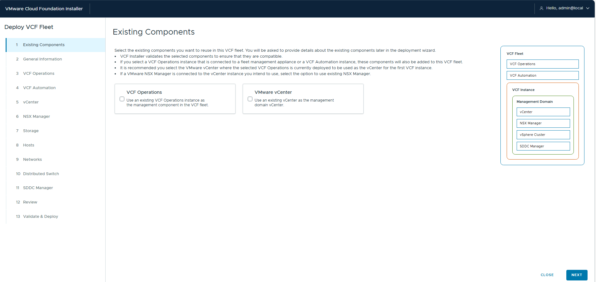
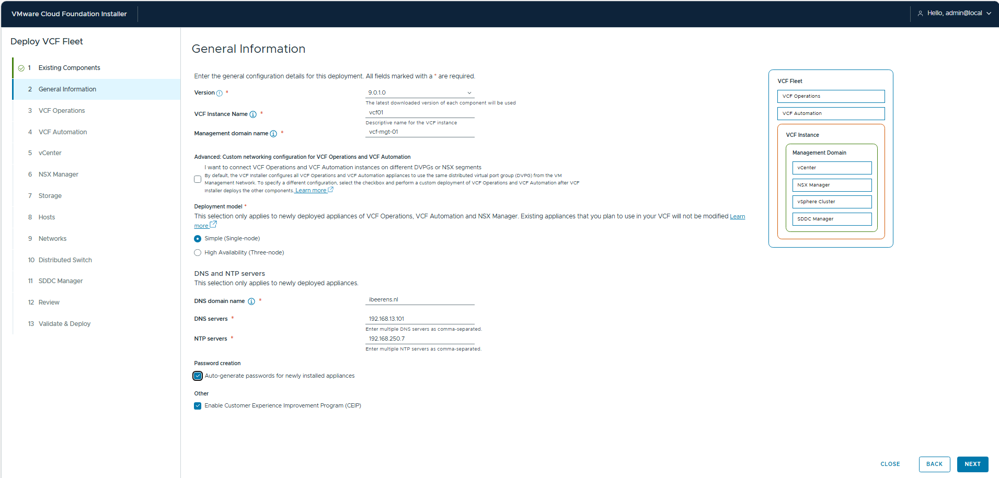
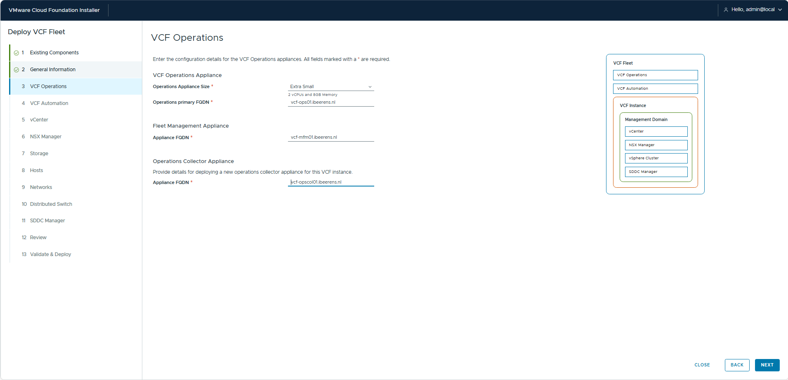
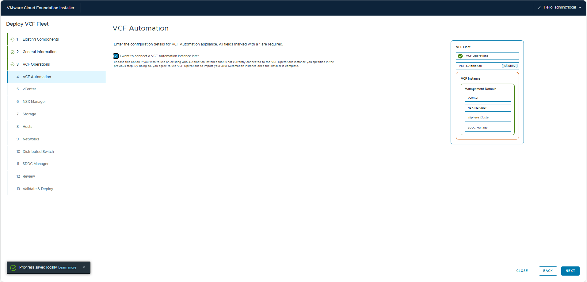
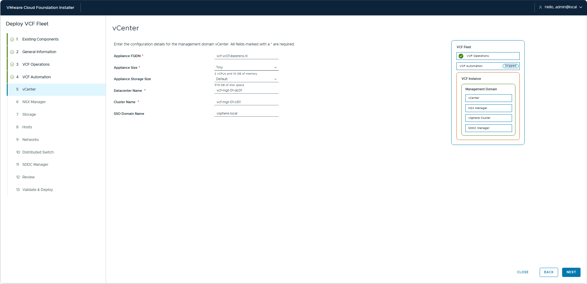
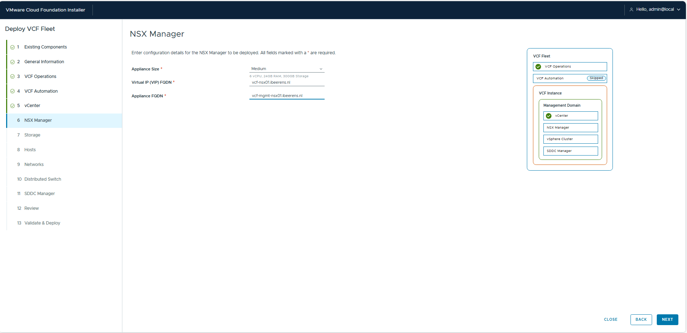
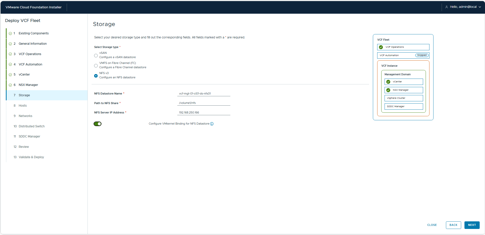
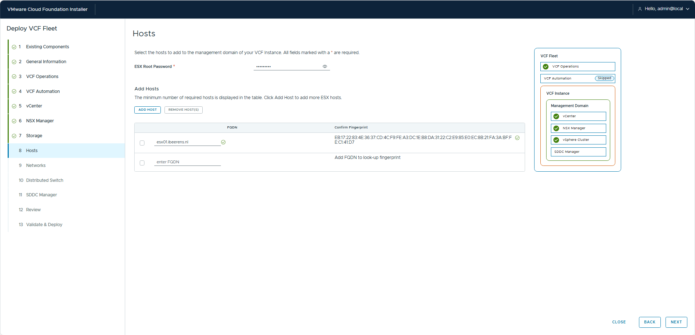

# VCF9 Singlehost configuration

## VCF9 Single host configuration

| VLAN	| Role | IP Address |	Network |
| ---         | ---   | ---         | --- |
| 13	| management | 192.168.13.254/24	| 192.168.13.0 |
| 12	| vmotion	| 10.10.12.1/24	| 10.10.12.0 |
| 50	| vsan | 10.10.50.1/24	| 10.10.50.0 |
| 60	| ESX/NSX Edge TEP (overlay NSX) | 10.10.60.1/24	| 10.10.60.0 |
| 70	| Tier 0 Uplink	| 10.10.70.1/24	| 10.10.70.0 |
| 80	| Kubernets (cluster K8s bare-metal) | 10.10.80.1/24 | 10.10.80.0 |

## Host overview

| Hostname	  | FQDN	| IP Address	| Function |
| ---         | ---   | ---         | --- |
| dc02	| dc02.ibeerens.nl |192.168.13.101 | DNS Server and NTP source |
| esx01	| esxi01.ibeerens.nl | 192.168.11.10 | Physical ESX Server |
| vcf-depot	| vcf-depot.ibeerens.nl | 192.168.13.62 |	VCF Installer / SDDC Manager |
| vcf-ops01 | vcf-ops01.ibeerens.nl	| 192.168.13.70	| VCF Operations |
| vcf-mfm01 | vcf-mfm01.ibeerens.nl | 192.168.13.63 | VCF Operations Fleet Manager |
| vcf-opscol01 | vcf-opscol01.ibeerens.nl | 192.168.13.64	| VCF Operations Proxy Collector |
| vcf-vc01 | vcf-vc01.ibeerens.nl | 192.168.13.69 | vCenter Server for Management Domain |
| vcf-nsx01	| vcf-nsx01.ibeerens.nl	| 192.168.13.65	| NSX Manager VIP for Management Domain |
| vcf-mgmt-nsx01 | vcf-mgmt-nsx01.ibeerens.nl | 192.168.13.66	| NSX Manager for Management Domain |
| vcf-edge01a | vcf-edge01a.ibeerens.nl | 192.168.13.67	| NSX Edge 1a for Management Domain |
| vcf-edge01b | vcf-edge01b.ibeerens.nl | 192.168.13.68 | NSX Edge 1b for Management Domain |
| vcf-auto01 | vcf-auto01.ibeerens.nl	| 192.168.13.69	| VCF Automation |

8.18.5.24967137
