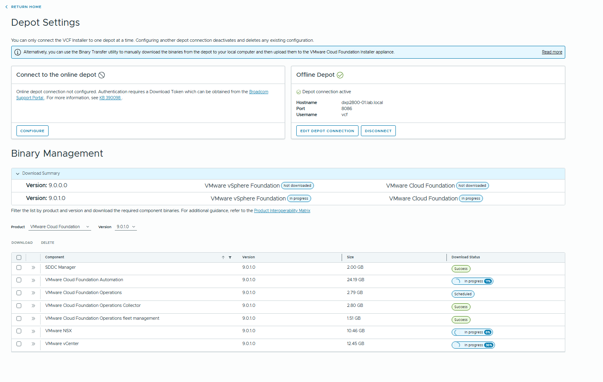
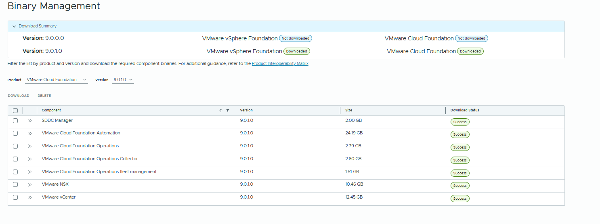
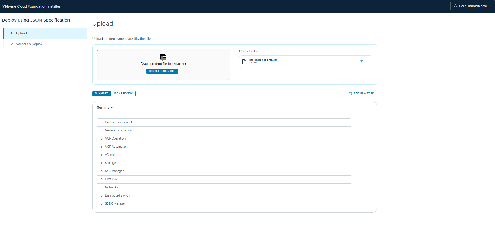
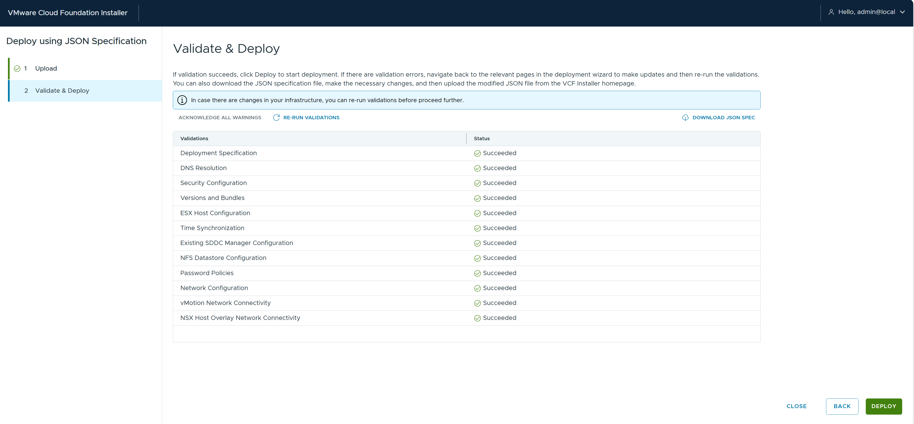
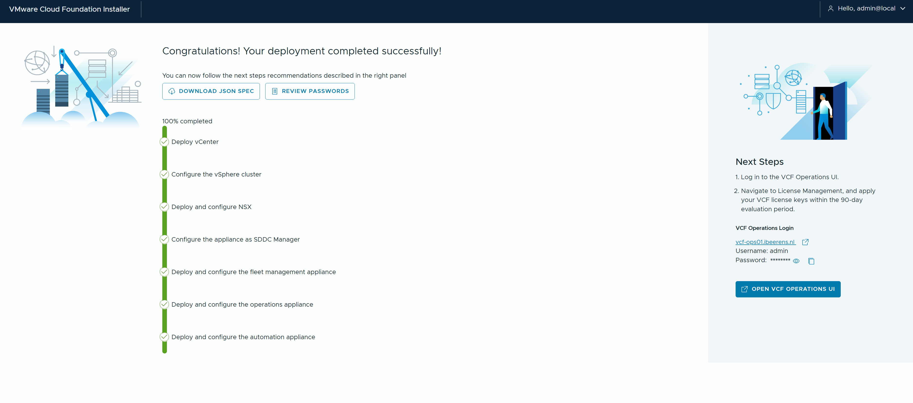

# VCF9 Single host configuration

- Do not use .local domain names

Enable SSH in the VCF installer
```
Edit the /etc/ssh/sshd_config file.
Set PermitRootLogin to yes or no as desired.
sudo systemctl restart sshd
```

Enable Single host
```
echo "feature.vcf.vgl-29121.single.host.domain=true" >> /home/vcf/feature.properties
echo "feature.vcf.internal.single.host.domain=true" >> /home/vcf/feature.properties
echo 'y' | /opt/vmware/vcf/operationsmanager/scripts/cli/sddcmanager_restart_services.sh
```

Enable HTTP 
```
echo "lcm.depot.adapter.httpsEnabled=false" >> /opt/vmware/vcf/lcm/lcm-app/conf/application-prod.properties
systemctl restart lcm
```

Increasing the VCF Installer en SDDC Manager timeout (for resource constrained environments)

```
echo "nsxt.manager.wait.minutes=180" >> /etc/vmware/vcf/domainmanager/application-prod.properties
echo 'y' | /opt/vmware/vcf/operationsmanager/scripts/cli/sddcmanager_restart_services.sh
```



- Download all the VCF 9.0.1 bits



- Create a snapshot of the appliance

- Use json file



- Check



The installation begins



## VCF9 Single host configuration

| VLAN	| Role | IP Address |	Network |
| ---         | ---   | ---         | --- |
| 13	| management | 192.168.13.254/24	| 192.168.13.0 |
| 12	| vmotion	| 10.10.12.1/24	| 10.10.12.0 |
| 50	| vsan | 10.10.50.1/24	| 10.10.50.0 |
| 60	| ESX/NSX Edge TEP (overlay NSX) | 10.10.60.1/24	| 10.10.60.0 |
| 70	| Tier 0 Uplink	| 10.10.70.1/24	| 10.10.70.0 |
| 80	| Kubernets (cluster K8s bare-metal) | 10.10.80.1/24 | 10.10.80.0 |

DNS server: 192.168.13.101
NTP sever: 192.168.250.7
Domain: ibeerens.nl

## Host overview

| Hostname	  | FQDN	| IP Address	| Function | CPUs | Memory (GB) | Disk (GB) | Size | 
| ---         | ---   | ---         | --- | --- | --- | --- | --- | 
| dc02	| dc02.ibeerens.nl |192.168.13.101 | DNS Server and NTP source | 2 | 4 | 100 | |
| esx01	| esxi01.ibeerens.nl | 192.168.11.10 | Physical ESX Server | 1 | 192 | 8 TB | |
| vcf-depot	| vcf-depot.ibeerens.nl | 192.168.13.62 |	VCF Installer / SDDC Manager | 4 | 16 | 914 | |
| vcf-ops01 | vcf-ops01.ibeerens.nl	| 192.168.13.70	| VCF Operations | 2 | 8 | 274 | xsmall | 
| vcf-mfm01 | vcf-mfm01.ibeerens.nl | 192.168.13.63 | VCF Operations Fleet Manager | |
| vcf-opscol01 | vcf-opscol01.ibeerens.nl | 192.168.13.64	| VCF Operations Proxy Collector | 4 | 16 | 264 | small | 
| vcf-vc01 | vcf-vc01.ibeerens.nl | 192.168.13.69 | vCenter Server for Management Domain | 4 | 21 | 743 | small |
| vcf-nsx01	| vcf-nsx01.ibeerens.nl	| 192.168.13.65	| NSX Manager VIP for Management Domain | 6 | 24 | 300 | medium | 
| vcf-mgmt-nsx01 | vcf-mgmt-nsx01.ibeerens.nl | 192.168.13.66	| NSX Manager for Management Domain |
| vcf-edge01a | vcf-edge01a.ibeerens.nl | 192.168.13.67	| NSX Edge 1a for Management Domain | |
| vcf-edge01b | vcf-edge01b.ibeerens.nl | 192.168.13.68 | NSX Edge 1b for Management Domain | |
| vcf-auto01 | vcf-auto01.ibeerens.nl | 192.168.13.69	| VCF Automation | 24 | 96 | 529 | |